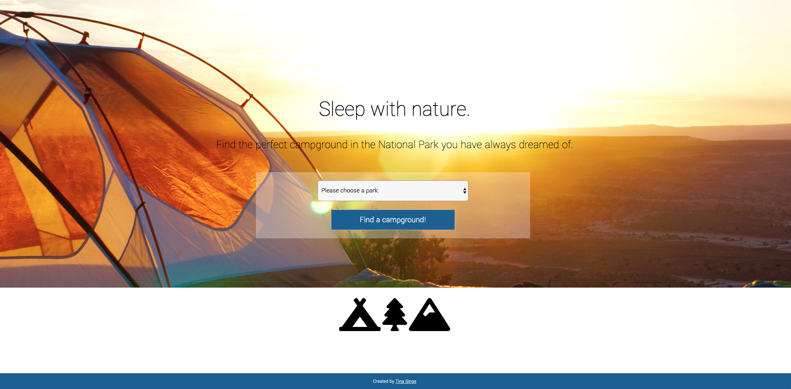
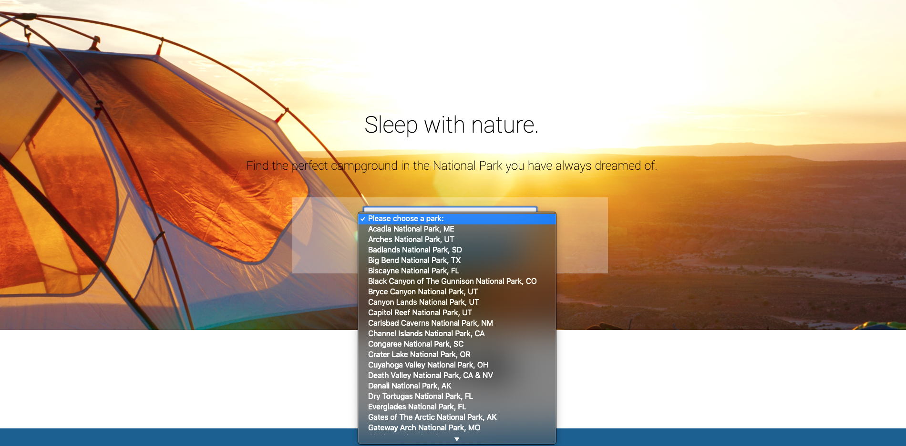
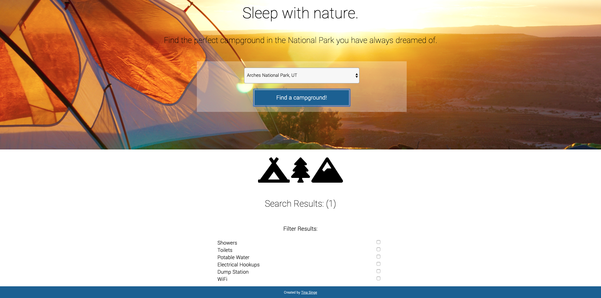
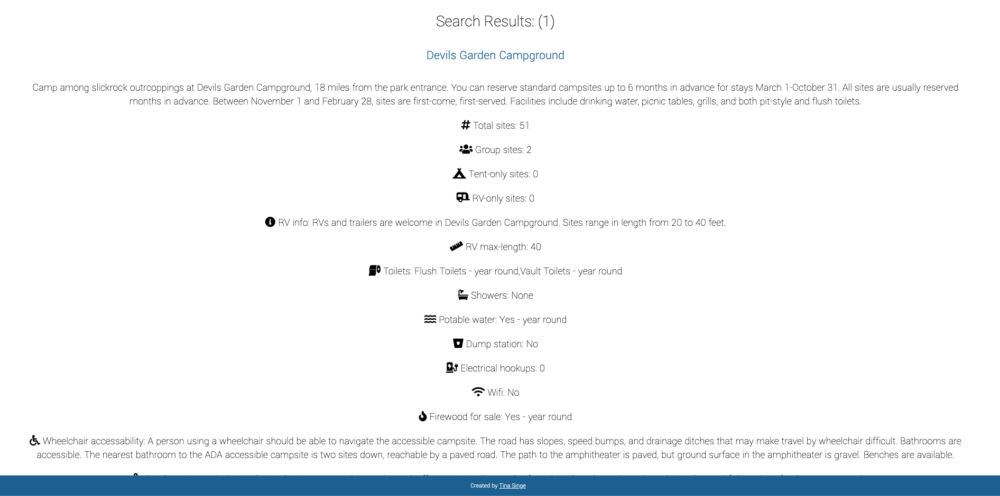

README:

# National Park Campground Finder
An app designed to allow users to search specific National Parks and get a list of official campgrounds in return with all necessary need-to-know information.

Link to live app: https://tinasinge319.github.io/npsCampingApp/

## Screenshots
Landing Page:

Drop-down Menu:

Filters:

Results:

## Summary:
This app is built to be used as a central informational place to allow users to search campgrounds within a specific National Park. When a user comes to the site, they can choose a National Park from the drop down menu and find campgrounds within that park. If the user would like, they can filter their results by the following park amenities:
- Showers
- Toilets
- Potable Water
- Electrical Hookups
- Dump Station
- WiFi

By filtering based on amenities, their results are re-displayed based on their selections. The users are then given the following information for each campground:
- Number of results
- Name of campground
- Description of campground
- Number of total camping sites
- Number of group camping sites
- Number of tent-only camping sites
- Number of RV-only camping sites
- Information on RVs
- Maximum RV length allowed
- Information on toilets
- Information on showers
- Information on potable water
- Information on dump stations
- Information on electrical hookups
- Information on wifi
- Information on the sale of firewood
- Information on accessibility
- Directions to the campground
- Weather
- Additonal information
- Regulations
- A link to the reservation site

Users can search through the list of parks and campgrounds and filter the results as many times as they would like.

## Technologies Used:
- HTML
- CSS
- JavaScript
- jQuery

## Resources:
National Park Service API: https://www.nps.gov/subjects/developer/api-documentation.htm#/
